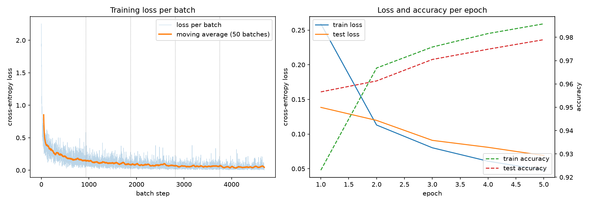

# Image classification from scratch: MNIST and CIFAR-100

Two parts. The first trains an MLP on MNIST without any deep learning framework:
forward pass, backpropagation and SGD run on a scalar autograd engine written by
hand, and the result is compared against the same network in PyTorch. The second
is three PyTorch training scripts, written to learn how convolutional networks
behave rather than to chase a benchmark.

Every model is trained from scratch on a MacBook (M2 Pro), no pretrained weights
anywhere.

## Part 1: an MLP without a deep learning framework

`src/mnist_mlp_micrograd.py` classifies MNIST with a 784-128-10 network and
reaches 97.90 % test accuracy. Nothing in the computation comes from PyTorch or
NumPy. The imports are `math` and `random`, plus `struct` and `gzip` to read the
MNIST files. Matplotlib is only used afterwards, for the figures.

### The engine

`src/micrograd.py` started as the notebook `src/micrograd.ipynb`, in which I
followed Andrej Karpathy's micrograd lecture. Its core is one class, `Value`. A
`Value` holds a number, its gradient, the values it was computed from, and a
small function that knows how to pass a gradient back to them:

```python
def __mul__(self, other):
    other = other if isinstance(other, Value) else Value(other)
    out = Value(self.data * other.data, (self, other), '*')

    def _backward():
        self.grad += other.data * out.grad
        other.grad += self.data * out.grad

    out._backward = _backward
    return out
```

Every operation works like this, so computing a loss builds a graph of `Value`
objects as a side effect. `loss.backward()` sorts that graph topologically and
calls each `_backward` from the loss down to the weights. That is the chain rule
and nothing else.

On top of `Value` sit `Neuron`, `Layer` and `MLP`, a `cross_entropy` loss and an
`SGD` class with `zero_grad()` and `step()`.

### What MNIST needed beyond the notebook

The notebook trains a 3-4-4-1 network with tanh on four data points. For MNIST
the engine needed more:

- `relu` for the hidden layer, and `log` for the loss.
- Softmax with cross-entropy, built from `exp` and `log` as
  `log(sum_j exp(z_j)) - z_target`. The largest logit is subtracted first.
  Softmax does not change under that shift, and `exp` can no longer overflow.
- The same weight initialisation as `torch.nn.Linear`, uniform in
  ±1/sqrt(fan_in). The notebook draws from ±1, and with a different start the
  comparison against PyTorch would not be fair.
- An iterative topological sort. The recursive one from the notebook hits
  Python's recursion limit on graphs this deep.
- `MLP.predict`, a forward pass on plain floats that builds no graph. It is used
  for evaluation and plays the role of `torch.no_grad()`.

Two bugs from the notebook surfaced along the way. `__pow__` assigned the
gradient with `=` where it has to accumulate with `+=`, and `Value - Value`
crashed because `__neg__` was missing.

### One training step

MNIST is read straight from the IDX files: a 16-byte header, then 784 bytes per
image. A byte has only 256 possible values, so normalising with the training
mean and standard deviation (0.1307 and 0.3081) is a lookup in a table of 256
floats.

A mini-batch of 64 images becomes 64 separate graphs that share the same weight
`Value`s. Their losses are averaged into one `Value`, and a single `backward()`
call fills the gradient of every weight with the batch mean:

```python
losses = []
for index in batch:
    pixels = [table[byte] for byte in images[index]]
    logits = model(pixels)
    losses.append(cross_entropy(logits, labels[index]))
loss = sum(losses[1:], losses[0]) * (1 / len(batch))

optimizer.zero_grad()
loss.backward()
optimizer.step()
```

### The speed problem

A purely scalar engine does not get through MNIST. Built from single `*` and `+`
nodes, the first layer alone needs 784 × 128 multiplications and as many
additions, so one image creates about 200,000 `Value` objects. I measured 0.6 s
per image for forward and backward. Five epochs over 60,000 images would have
taken 50 hours.

`Value.weighted_sum` is the one place where the engine leaves the scalar idea.
It computes `sum(w_i * x_i) + b` as a single node with its own backward rule:

```python
def _backward():
    grad = out.grad
    if grad == 0.0:
        return  # e.g. behind a ReLU that is switched off: nothing to add
    for w, x in zip(weights, xs):
        w.grad += x * grad
    ...
    bias.grad += grad
```

One image now takes about 300 nodes and 10 ms. Every weight is still its own
`Value`, and the gradients are identical to the ones from single nodes.

### Result

Architecture, loss, learning rate (0.1), batch size (64) and epoch count (5) are
the same as in `src/mnist_mlp.py`.

| | PyTorch | micrograd |
|---|---|---|
| Parameters | 101,770 | 101,770 |
| Test accuracy | 97.77 % | 97.90 % |
| Errors out of 10,000 | 223 | 210 |
| Training time, 5 epochs | under a minute | 53 minutes |

| Epoch | Train loss | Train accuracy | Test loss | Test accuracy |
|---|---|---|---|---|
| 1 | 0.259 | 92.30 % | 0.138 | 95.66 % |
| 2 | 0.113 | 96.68 % | 0.120 | 96.13 % |
| 3 | 0.080 | 97.58 % | 0.091 | 97.05 % |
| 4 | 0.061 | 98.16 % | 0.081 | 97.49 % |
| 5 | 0.048 | 98.58 % | 0.069 | 97.90 % |



The 13 errors between the two versions say nothing about the implementations.
Initial weights and batch order come from different random number generators,
and there is one seed each. The gradients themselves were compared directly:
for the same weights and the same batch of 8 inputs, micrograd and PyTorch
(float64) differ by at most 1.7e-16.

The most frequent confusion is 9 predicted as 4, 12 times, with 4 predicted as
9 right behind at 9. The confusion matrix and 64 of the misclassified digits are
in `results/mnist_mlp_micrograd_*.png`.

```bash
cd src
uv run python mnist_mlp_micrograd.py
```

Setting `TRAIN_SIZE` and `TEST_SIZE` at the top of the script to something like
3,200 and 1,000 gives a test run of about three minutes.

## Part 2: PyTorch on MNIST and CIFAR-100

The CIFAR-100 part is the interesting one here: four controlled runs that
isolate what longer training, augmentation and model capacity each contribute.

### Results

| Script | Dataset | Parameters | Test accuracy |
|---|---|---|---|
| `src/mnist_mlp.py` | MNIST | 101,770 | 97.77 % |
| `src/mnist_cnn.py` | MNIST | 421,642 | 99.16 % |
| `src/cifar100_cnn.py` | CIFAR-100 | 4,738,596 | 76.20 % |

The two MNIST scripts use the same optimizer, learning rate, batch size and
epoch count, so the only difference is the model. Two convolution blocks instead
of one hidden layer cut the errors from 223 to 84 out of 10,000 test images, for
4.1 times the parameters. In accuracy that reads as a modest 1.39 points, which
is why error counts are the more honest number this far up the scale.

The CIFAR-100 run takes about 52 minutes on an M2 Pro, roughly 21 seconds per
epoch.

### The CIFAR-100 ablation

Each row changes one thing against the row above it.

| Run | Epochs | Augmentation | Parameters | Test accuracy | Δ |
|---|---|---|---|---|---|
| A | 40 | crop + flip | 1.17 M | 70.44 % | baseline |
| B | 150 | + TrivialAugmentWide + RandomErasing | 1.17 M | 72.50 % | +2.06 |
| C | 150 | + TrivialAugmentWide + RandomErasing | 4.74 M | 76.20 % | +3.70 |
| D | 250 | + TrivialAugmentWide + RandomErasing | 4.74 M | 76.43 % | +0.23 |

Two things came out of this that I would not have guessed.

Capacity mattered more than regularisation. Going from three conv blocks to four
(B to C) bought 3.70 points, while stronger augmentation plus almost four times
the epochs (A to B) bought 2.06. I had expected the opposite order, because run
A overfitted badly: train 84.3 % against val 70.8 %. Run B shows why capacity was
the binding constraint. Its training accuracy ended 9 points *below* validation,
so that model could not even fit the augmented training data.

Training time saturates. Run D spent 100 extra epochs for 0.23 points, and the
train-validation gap reopened from +0.25 to +2.97. Past 150 epochs the model only
learns the training set better. The script therefore defaults to 150.

Run C was repeated after the code was restructured and reproduced epoch by epoch,
including the final 76.20 %.

Caveat: one seed per configuration. I never measured how much two runs of the
same configuration differ, so the +0.23 in run D is probably noise, and the
larger deltas are likely but not provably real.

### What the errors look like

Every run prints its most frequent confusions and writes a confusion matrix to
`results/`.

On CIFAR-100 almost every remaining error sits inside one of the superclasses:

- trees: maple, oak, pine and willow, confused in both directions
- people: boy, girl, man, woman, baby
- aquatic animals: otter and seal, dolphin and shark

Symmetric confusions like these are what you would expect from classes that are
hard to tell apart at 32×32, rather than from a model that learned something
wrong. Worst class by recall is `otter` at 49 %.

MNIST shows the same structure at a much smaller scale. The MLP's single worst
confusion is 7 predicted as 9, 21 times. The CNN's worst is 3 predicted as 5,
7 times. The pair 4 and 9 survives in both models.

## Setup

```bash
uv sync
cd src
uv run python cifar100_cnn.py
```

Datasets download themselves into `src/data/` on first run. Figures and
checkpoints are written to `results/`.

Set `NUM_WORKERS = 0` in the script when running inside Jupyter. On macOS the
DataLoader workers re-import the file, which is why everything that executes sits
below `if __name__ == "__main__"`.

## Method notes

Normalisation statistics (per channel mean and std) are computed on the training
split only.

CIFAR-100 uses a 45,000 / 5,000 / 10,000 train-validation-test split. The test
set is evaluated exactly once, at the end, with the checkpoint that had the best
validation accuracy. The MNIST scripts have no validation split: nothing is tuned
on MNIST, so the test set doubles as the per-epoch monitor. That is a shortcut,
and it would not be defensible if any hyperparameter had been chosen from those
numbers.

Augmentation is applied to the training split only. Both splits point at the same
raw files through two dataset objects with different transforms.

`AdaptiveAvgPool2d(1)` instead of a large `Flatten` into a dense layer. In the
first version of the CIFAR model the first linear layer held 8.39 M of 8.72 M
parameters. Global average pooling removed almost all of that and made the model
independent of the input size.

## What this is not

A benchmark result. Published from-scratch numbers on CIFAR-100 reach about 85 %,
and anything above 90 % in the literature involves ImageNet pretraining. 76 % is
what a small VGG-style network gets on a laptop.

## Files

```
├── README.md
├── pyproject.toml
├── uv.lock
├── src/
│   ├── helper.py                # matplotlib figures shared by all scripts
│   ├── mnist_mlp.py
│   ├── mnist_cnn.py
│   ├── cifar100_cnn.py
│   ├── micrograd.py             # autograd engine, MLP, loss, SGD
│   ├── micrograd.ipynb
│   └── mnist_mlp_micrograd.py
└── results/
    ├── mnist_mlp_*.png
    ├── mnist_mlp_micrograd_*.png
    ├── mnist_cnn_*.png
    └── cifar100_*.png
```